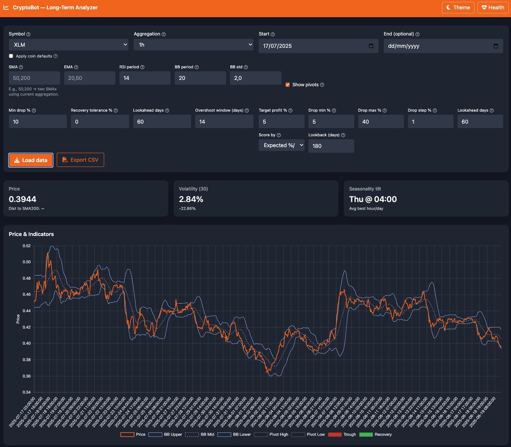
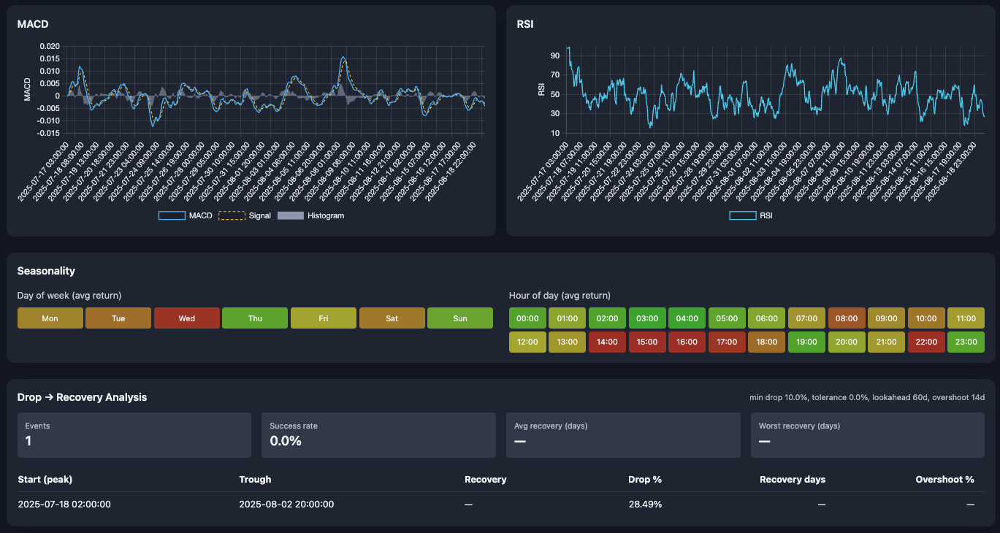
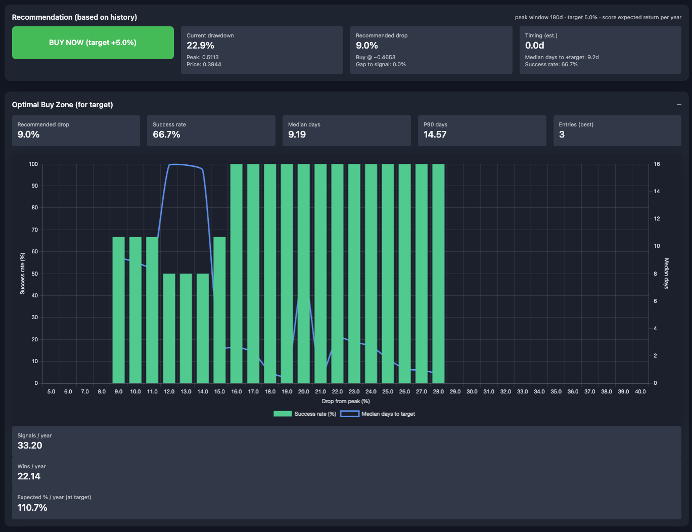

# Cryptobot Analyser

This project is a dashboard that makes use of the price history fetched from the [TuxTrader trading bot](https://github.com/royen99/cryptobot-trader). It attempts to provide insights and analytics for cryptocurrency trading strategies.

[](https://hub.docker.com/r/royen99/cryptobot-analyse)
[](https://hub.docker.com/r/royen99/cryptobot-analyse)
[](https://github.com/royen99/cryptobot-analyse/actions/workflows/docker-publish.yml)
[](https://github.com/royen99/cryptobot-analyse)
[](https://hub.docker.com/r/royen99/cryptobot-analyse/tags)
[](https://opensource.org/licenses/MIT)

## Used indicators (for now)
✅ Exponential Moving Average (EMA) \
✅ Simple Moving Average (SMA) \
✅ Relative Strength Index (RSI) \
✅ Bollinger Bands (BB) \
✅ MACD (Moving Average Convergence Divergence) \
✅ Drop/Recovery time \
✅ Support/Resistance levels (estimated) \

## Calculates
✅ Optimal drop grid \
✅ Optimal recovery grid \
✅ Entry times for drop/recovery \
✅ Median interval signal days \
✅ Current recommendation

## Installation

### Prerequisites
Since this monitor should work with the Cryptobot-trader, you need to have the trading bot set up and running. Follow the instructions in the [Trader](https://github.com/royen99/cryptobot-trader) repository to get it up and running.

Use the supplied config.json.template file for your database connection settings, and other configurations. \
Make sure to rename it to `config.json` and fill in your details and place it in the appropriate directory (.env by default). 

The `config.json` file uses the exact same format as the Cryptobot-trader (you can also use the same docker volume).

### Setup config files
Create a directory for your environment files:
   ```bash
   mkdir -p analyser && cd analyser
   mkdir -p .env
   ```
Create a `config.json` file in the `.env` directory and fill in your details. You can use the `config.json.template` file as a reference.

If you're starting fresh, ensure that the `init.sql` file is also in your current directory.

### Use the Podman Compose file to start the services:
Note that the `docker-compose-sample.yml` file is compatible with Podman Compose, so you can use it directly and is setup to start the analyser.

   ```bash
   podman-compose -f docker-compose-sample.yml up -d
   ```

## Integration with other projects

The heart of the various services is the actual [TuxTrader](https://github.com/royen99/cryptobot-trader) trading bot. (for data logging an actual trades). \
Along with the trader is the [TuxTrader Monitor](https://github.com/royen99/cryptobot-monitor) which provides insights on your current holdings and trade performance.

## Screenshots






## Supported Platforms  

✅ **Mac (Intel/Apple Silicon)**  
✅ **Linux (AMD64/ARM64)**  
✅ **Raspberry Pi (ARM64)**  (Tested on Raspberry Pi 4 Model B/Ubuntu 24.04.3 LTS)

## Donations
If you find this project useful and would like to support its development, consider making a donation:

- BTC: `bc1qy5wu6vrxpclycl2y0wgnjjdxfd2qde7xemphgt`
- ETH: `0xe9128E8cc47bCab918292E2a0aE0C25971bb61EA`
- SOL: `ASwSbGHvcvebyPEUJRoE9aq3b2H2oJSaM7GsZAt83bjR`
- Via [CoinBase](https://commerce.coinbase.com/checkout/00370bad-7220-4115-b15f-cda931756c6a)

**Big Fat Disclaimer**** This is a work in progress and may not reflect the most accurate trading signals. _Always do your own research_ before making trading decisions. It also requires a substantial amount of historical data (> 2 months as bare minimum) to provide reliable insights..
